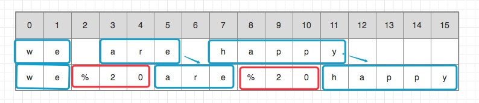

# algorithm-offer
《剑指offer》算法解析

##### 1.空间换时间   2.时间换空间   3.空间和时间中和

## 目录

* <a href="#二维数组中的查找">1. 二维数组中的查找</a>
* <a href="#替换空格">2. 替换空格 </a>
* <a href="#从尾到头打印链表 ">3. 从尾到头打印链表  </a>


<a id="二维数组中的查找"></a>
#### 1.二维数组中的查找
题目描述:在一个二维数组中，每一行都按照从左到右递增的顺序排序，每一列都按照从上到下递增的顺序排序。请完成一个函数，输入这样的一个二维数组和一个整数，判断数组中是否含有该整数。

```
class Solution {
public:
    bool Find(int target, vector<vector<int> > array) {
    if (array.size() == 0)
    {
        return false;
    }
    
    
    // 因为左右、上下都是有序递增，每一列的size肯定也一样长（也就是取第0个和其他都是一样的size）
    int y0_count = (int)array[0].size();
    
    for (int y = 0 , x = y0_count -1 ; y < array.size() && x >= 0 ;)
    {
        int yx_value = array[y][x];
        if (yx_value == target)
        {
            return true;
        }
        
        if (target > yx_value)
        {
            y++;
            continue;
        }
        
        if (target < yx_value)
        {
            x --;

            continue;
        }
    }

    return false;
    }
};

```

<a id="替换空格"> </a>
#### 2.替换空格 
题目描述:请实现一个函数，将一个字符串中的空格替换成“%20”。例如，当字符串为We Are Happy.则经过替换之后的字符串为We%20Are%20Happy。

解析： 1.从前到后，坏处是每次替换要把后面的全部都多次移动，性能差
      2.从后向前，先开辟好替换后空间，把最后一个移动到替换后空间的最后一个位置，依次向前执行
      

```
void replaceSpace(char str[], int length)
{
    if(str == NULL || length < 0)
    {
        return ;
    }
    
    // 计算出有多少空格和原理str的总长度
    int blanksCount = 0;
    int Originallength = 0;
    
    int i =0;
    while (str[i] != '\0')
    {
        Originallength++;
        if(str[i]==' ')
        {
            ++blanksCount;
        }

        i++;
    }

    // 如果替换后的空间大于给的空间 就直接return
    int newStrLength = Originallength + blanksCount * (3-1);
    if (newStrLength > length)
    {
        return;
    }
    
    // 替换
    int pnewStrLength = newStrLength;
    int pOriginStrLength = Originallength;
    while (pOriginStrLength >= 0 && pnewStrLength >= pOriginStrLength)
    {
        if(str[pOriginStrLength] == ' ')
        {
            str[pnewStrLength --] = '0';
            str[pnewStrLength --] = '2';
            str[pnewStrLength --] = '%';
        }
        else
        {
            str[pnewStrLength --] = str[pOriginStrLength];
        }
        
        pOriginStrLength --;
    }
    printf("str=%s\n",str);
}


int main(int argc, const char * argv[])
{    
    char pr[16] = "we are happy";
    replaceSpace(pr, 16);
    
    return 0;
}

```

<a id="从尾到头打印链表 "> </a>
#### 3.从尾到头打印链表 
题目描述:输入一个链表，按链表值从尾到头的顺序返回一个ArrayList

```
#include <iostream>
#include <vector>

using namespace std;

struct ListNode {
    int val;
    struct ListNode *next;
    
    /** 构造函数 */
    ListNode(int x) :
        val(x),next(NULL){}
};


class Solution {
public:
    vector<int> printListFromTailToHead(struct ListNode* head) {
        vector<int> value;
        if(head != NULL)
        {
            value.insert(value.begin(),head->val);
            while(head->next != NULL)
            {
                value.insert(value.begin(),head->next->val);
                head = head->next;
            }
            
        }
        return value;
    }
};

/** 创建链表 */
ListNode *getNodes(int count)
{
    ListNode *node = (ListNode *)malloc(sizeof(ListNode *));
    node -> val = 0;
    node -> next = NULL;
    ListNode *head = node;
    
    for (int i = 1; i < count; i ++)
    {
        ListNode *newNode = (ListNode *)malloc(sizeof(ListNode *));
        newNode -> val = i;
        newNode -> next = NULL;
        head -> next = newNode;
        head = newNode;
    }
    
    return node;
}

int main()
{
    ListNode *node= getNodes(10);
    ListNode *currentNode = node;

    while (currentNode !=  NULL)
    {
        printf("currentNode.val =%d \n",currentNode->val);
        currentNode = currentNode -> next;
    }
    
    Solution *so = new Solution;
   vector<int> T =  so -> printListFromTailToHead(node);
    
    
    return 0;
}

```

